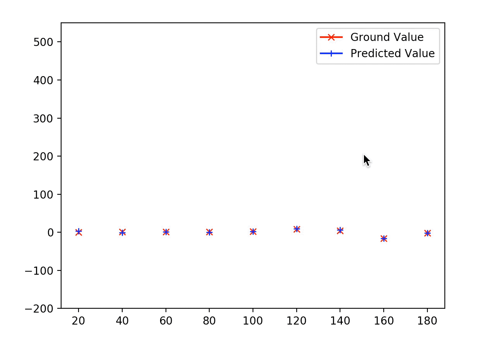

# Self-Driving-Car-V2
This is an implementation of [End to End Learning for Self-Driving Cars](https://devblogs.nvidia.com/deep-learning-self-driving-cars/) model developed by NVIDIA. This implementation uses exactly the same CNN architecture which was proposed by them to predict the steering angles by just using camera images. Please check out their [paper](https://arxiv.org/abs/1604.07316) for more information.

Also, check out my [Self-Driving-Car-V1](https://github.com/aravindmanoharan/Self-Driving-Car-V1) which is also a similar implementation, inspired by End to End Learning for Self-Driving Cars, but it is implemented on a less complex dataset.

## Dataset

The Dataset can be downloaded from [here](https://github.com/SullyChen/driving-datasets) and extract into the repository folder.

## Requirements

This CNN model is implemented using TensorFlow framework.

```
pip install tensorflow
```

Please check the requirements.txt file for all the packages which you need to install. Most of the packages can be installed using the pip package manager.

## CNN Architecture

The architecture used is the same as proposed in this NVIDIA paper on End to End Learning for Self-Driving Cars. The network consists of 9 layers, 5 convolutional layers and 4 fully connected layers. The architecture consists of three strided convolutional layers with a kernel size of 5 x 5 with 2 x 2 stride and two non-strided convolutional layers with a kernel size of 3 x 3 with no strides followed by four fully connected layers. The convolutional layers may perform as feature extractions and the the fully connected layers may function as a controller for steering.

<p align="center">
  
</p>

## Training the model

The model achieves good results by training the model for 30 epochs. We use mean squared error as our cost function. The model is trained on 80% of the data. Let's see how it performs on our dataset (The output shown below is an edited GIF with more number of frames per second).


Let's compare the predicted steering angles with the ground values. In the below plot, the symbol 'x' denotes the ground truth and the symbol '+' denotes the predicted values. From the plot, we can see that the performance of our trained model delivers good results. The plot is shown below.



## Reference

1. Bojarski, Mariusz, Davide Del Testa, Daniel Dworakowski, Bernhard Firner, Beat Flepp, Prasoon Goyal, Lawrence D. Jackel et al. "End to end learning for self-driving cars." arXiv preprint arXiv:1604.07316 (2016).

2. This implementation also took a lot of inspiration from the [Sully Chen](https://github.com/SullyChen/Autopilot-TensorFlow) and [Akshay Bahadur](https://github.com/akshaybahadur21/Autopilot/tree/master/Autopilot_V2) GitHub repositories. 

## Have questions? Need help with the code?

If you're having issues with or have questions about the code, [file an issue](https://github.com/aravindmanoharan/Self-Driving-Car-V2/issues) in this repository so that I can get back to you soon.
